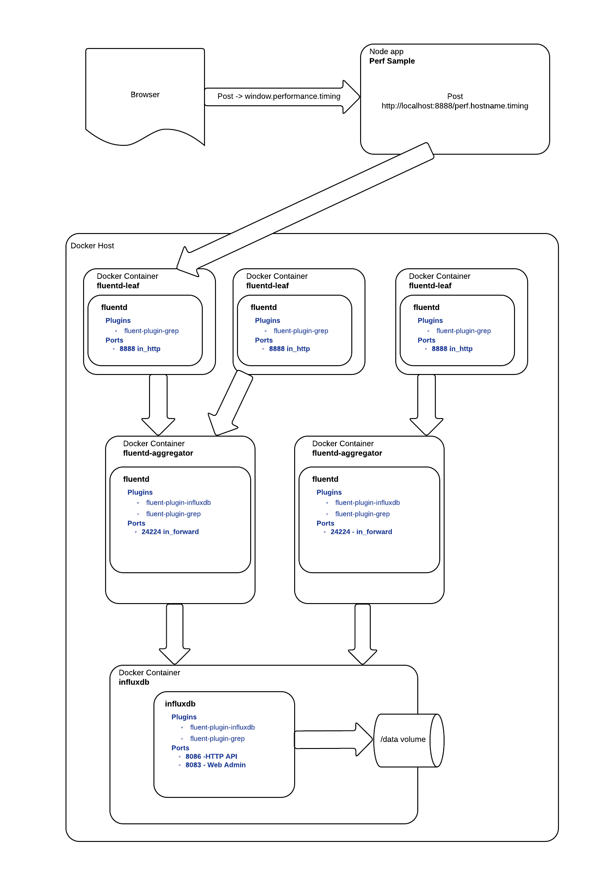

### Docker containers for fluentd with storage in influxdb 

### Installation
* [Build & run influxdb image](/influxdb)
* [Build the base fluentd image](/fluentd)
* [Build & run fluentd-aggregator image](/fluentd-aggregator)
* [Build & run fluentd-leaf image](/fluentd-leaf)

### Sample App
* [Express Sample app](/PerfSample)

### Overview
 

